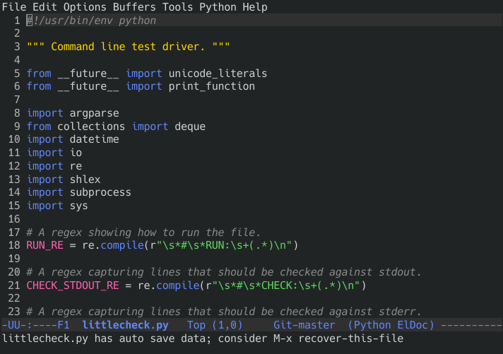

Your Defaults Could Be Better
####################################

:date: 2020-05-23 12:30
:category: software

My Emacs configuration is 655 lines.

This means a few things:

- I need to add 11 more.
- Emacs is amazingly configurable and programmable [#]_
- Emacs could really stand to have some of these as defaults.

What do I mean by that last thing?

Well, see for yourself. Here's emacs as it ships, out of the box:

There is one word for that colorscheme, and it's ugly. It's legendarily ugly, enough so that it is known as "angry fruit salad".

Now. What if we changed that? What if the default Emacs colorscheme was... you know... acceptable? It's not like there's a colorscheme that's perfect for all users, but it's definitely better than the current one.

Here's what that same file looks like with a different colorscheme and line-number display:

Is that not nicer?

---------------

There is one change I always want to do on every single linux system I have access to, and that is changing the readline bindings for the up/down arrow.

By default they step through the history incrementally. Press up once for the last command, press again for the second-to-last, press again for the one before that, and so on.
If you've entered something previously, it's overwritten by the command, it goes strictly chronologically.

There's an alternative binding called "history-search-backward" that does the same thing, *iff* the buffer is empty when you start.
The magic happens when you've entered something, in which case it will step through the history, but only show entries that *match* what you have entered.

The beauty of this is that it does strictly *more* - if you want to step through the history, you can! Just have an empty buffer and press up! If you want to search, you can! Just enter what you want, and press up!

Is that not nicer? [#]_

-----------------

Most software has defaults that just accumulated over time. Features were introduced, and disabled by default. Configuration variables were added, and set to a certain default.
Everyone is afraid of changing the defaults because it might alienate people who like the current defaults, and it's always easy to tell people that "it's configurable".

There are other ways to go about this. There are some projects to provide better defaults, like "vim-sensible" [#]_. Of course that means people have to know about them and configure them. That works for some, personally I'd rather just install emacs and not *have* to do anything to not get angry fruit salad. [#]_

What I'm getting at is: There is a better way. We could just change the defaults. Of course it would be possible to change the wrong defaults, but that's just design.

Footnotes
---------

.. [#] It *ships* with Tetris.
.. [#] Of course there's a bit of disclaimer needed here. I'm involved with the fish shell - which you might view as a competitor to bash, and that notably has a default like history-search-backward. I think the point stands - the default *in readline* is bad and should be changed.
.. [#] It's full of stuff like "show where the search string matches" and "enable syntax highlighting".
.. [#] I would of course still configure 50 other things - there are 650 other lines in my config, after all.

