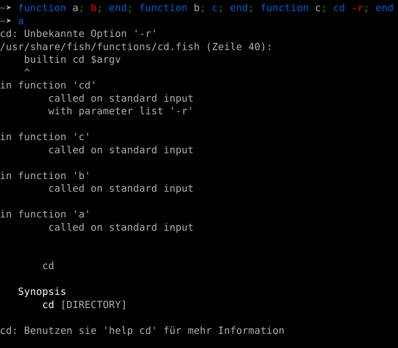
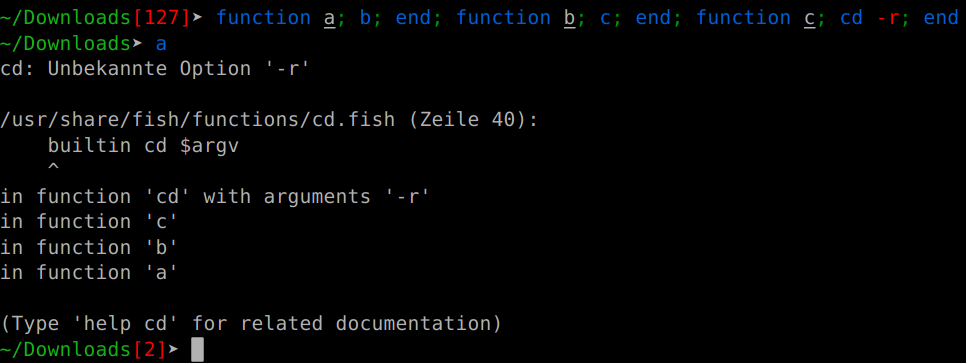

Cool stuff in fish 3.1
####################################

:date: 2019-06-29 20:20
:category: fish

We're at that point in the release cycle where it's taking shape, and we're slowly thinking about maybe releasing. We don't have a set release schedule or anything, and there's quite some stabilization to be done, but we know most of what will be in the release, so now seems like a good time to talk about it.

So here's some of my favorite things about the next fish release:

No more buffering (in some cases)
---------------------------------

Fish has a long-standing issue, in that it fully buffers the output of all builtins and functions.

That means that, for instance, something like

.. code-block:: fish

   cat largefile | grep something

would only show the output once everything was processed (because fish ships a default `grep --color=auto` "alias" [#]_).

In 3.1, this restriction was relaxed for the last process in a pipeline, so the above won't buffer anymore. This makes some things much faster, and even allows functions to read indefinite output - `ip monitor | grep` would appear to hang before.

Nicer error messages
--------------------

Our builtins were a bit... chatty, when it came to errors.

[#]_ 

Also `test` now shows a stack trace on error, making it actually possible to find where the error occured. This is especially important because `test` has some sharp edges.

`argparse`'s error messages now use the current function name by default, so it's often unnecessary to explicitly give a name. Since argparse parses arg(ument)s, its errors are errors of the "program" or function it parses them for, so this seemed like the right thing to do.

Brace expansion doesn't trigger unless necessary
------------------------------------------------

One of my favorite things is making FAQs obsolete.

A question we frequently get [#]_ is why `git reset HEAD@{0}` isn't working. The reason for that is that fish, unlike e.g. bash, interpreted the `{0}` as a brace expansion [#]_ with one element, so it expanded to `git reset HEAD@0`, and git wouldn't take that.

Instead, we now only interpret braces as triggering brace expansion if there is a "," (i.e. more than one element) or a variable expansion (possibly more than one element). So git works as expected, any useful brace expansion continues working.

This is, strictly speaking, backwards-incompatible. We still allow it because it's very unlikely to be a problem in practice, because the old syntax was useless [#]_.

Some builtin niceties
------------------------------

- `-q` now means "query" across the board for all "does this kind of thing exist" builtins - whether it's `command`, `functions`, `builtin` or `type`.
- `complete -C foo` works instead of requiring `complete -Cfoo`.
- `math` now allows "x" for multiplication. This is useful because `math` is an ordinary builtin, so `*` would be expanded. `math 5 x 2` is nicer to type than `math '5 * 2'`.
- `count` will now also read from stdin - `count </etc/hosts` now works.
- `argparse` gained a new `--ignore-unknown` option so you can parse the arguments in multiple stages (or, in completions, ignore options you don't care about).

Nicer semicolon handling in fish_indent
---------------------------------------

`fish_indent`, our autoformatter for fish scripts, will now turn most semicolons into line breaks.

So

.. code-block:: fish

    echo; echo

becomes

.. code-block:: fish

    echo
    echo

The exception is `and` and `or`, because we are okay with

.. code-block:: fish

   foo; and return

and don't really want

.. code-block:: fish

   if true
   and false

So in this case, it will just keep whatever is there, whether that's line breaks or semicolons.

Unicode version autodetection
-----------------------------

Because fish does a bunch of cursor movement (for suggestions and syntax highlighting), it needs to know the width of characters. Even worse, it needs to know what width the terminal thinks the characters are. This mostly works [#]_, only plenty of characters *changed* width in Unicode 9, so we need to know if the current system understands Unicode 9 [#]_.

So what we actually do is ask the system for the width of `😃`. If it says 2, we think it's Unicode 9-capable. If it says anything else, we guess it doesn't.

There are some other unicode improvements, including for variation selectors and korean characters [#]_.

.. [#] Remember, fish emulates aliases via functions.
.. [#] If I made this comparison with `string` instead of `cd`, the old error wouldn't fit on the screen.
.. [#] But didn't mention in the FAQ because we forgot to add it.
.. [#] The `/usr/{s,}bin` stuff.
.. [#] We have already changed what `{}` means in 3.0 - before it was a zero-element brace expansion, which means it would always be removed entirely.
.. [#] It's the bain of my existence.
.. [#] Ubuntu 16.04, which is still supported, doesn't.
.. [#] Both of which break a core assumption of our code - that the width of each codepoint is independent. Variation selectors change the width of what they are attached to, and korean "characters" are composed of three parts, each of which their own codepoint. Truly solving this requires a major rearchitecture, so we hack around it for now.
